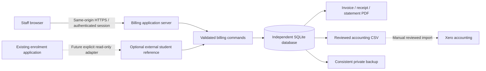

# Rosewood billing architecture

Decision date: 12 September 2026. Status: initial build design; read with the [research dossier](research/README.md) and [delivery plan](IMPLEMENTATION-PLAN.md).

## Product boundary

Rosewood Billing is an independent staff application for family billing accounts, prospective or active students, fee invoices, verified payment receipts and accounts-receivable progress. Its first release provides a real persistent server and authenticated staff portal. It does not require an enrolled student, enrolment backend credentials, a Xero connection or a payment gateway.

The working assumption is that “Xerox” refers to Xero. Until clarified, accounting integration remains optional. A reviewed CSV can assist import into Xero as drafts; export is never described as synchronisation, reconciliation, delivery or payment. The application sends no messages, initiates no payment and creates no bank transfer. Receipt generation records staff-verified money already received.

## Bounded components

The service uses Node.js 24.14+ and built-in SQLite, with prepared statements, foreign keys, WAL, full synchronous durability and short immediate write transactions. Browser assets are served only by the billing server. It never exposes a database file or embeds real records in a static JavaScript bundle. Runtime storage belongs outside the repository and outside cloud-sync folders. A single server owns a local durable disk; network filesystems, Lambda temporary storage and multiple replicas are unsupported. A future PostgreSQL store is the migration path for multiple replicas, not a shared SQLite file.

This is an engineering choice for a small school's initial operational volume, rather than a claim that SQLite replaces managed production operations. It provides relational transactions without provisioning or modifying the existing AWS stack. Encrypted hosting volumes, private tested backups, HTTPS, approved named access and an operator remain prerequisites for real-data hosting. See official [SQLite deployment guidance](https://www.sqlite.org/whentouse.html), [WAL](https://www.sqlite.org/wal.html), [transactions](https://www.sqlite.org/lang_transaction.html), and [Node SQLite API](https://nodejs.org/api/sqlite.html).

## Entities and ownership

| Entity | Purpose and invariant |
|---|---|
| Billing account | Responsible payer identity, unique account code, postal details, contact permission and status. Separate accounts can represent independent payers; this release does not automatically apportion a student's fees between them. |
| Student | Independent billing ID, name, intended year/level and prospective/active/inactive state. Belongs to a billing account in this release; application reference is optional and never establishes enrolment. |
| Enrolment reference | Audited explicit unique reference attached to a student, with reason. It is labelled unverified until a future authenticated adapter validates it. |
| Fee item | Staff-maintained description, cent amount, tax classification, revenue category and optional accounting mapping. Changes affect future drafts only. Bonds cannot be fee items. |
| Invoice and lines | Draft becomes an immutable numbered issued snapshot of payer, seller, dates, student labels, line prices, discount, tax and totals. No deletion of financial history. |
| Payment | Recorded evidence of a reported payment; pending until finance staff verify it. Includes account, amount, fee/bond purpose, date, method and reference. |
| Allocation | Append-only application or release of confirmed fee money to one issued invoice of the same account. No allocation beyond available payment or invoice balance. |
| Receipt | Immutable numbered acknowledgement created once, atomically with payment confirmation. Snapshot of received amount, payer, verification and original allocation. Pending payments never get receipts. |
| Credit note | Numbered line-specific invoice adjustment with reason and original tax classification, posted against an issued invoice without rewriting it. Cannot exceed current outstanding balance; release a payment allocation first when correcting a paid invoice. |
| Refund | Evidence of an already completed refund, limited to confirmed unapplied fee money or held bond money. Outgoing reference/date is unique across original receipts, independent of amount or incoming payment method. It never calls a payment provider. |
| Payment plan | Agreed dates and cent-exact instalments for an issued invoice. Schedule progress is derived from applied money/credits and remains separate from invoice due date and ledger settlement. |
| Billing batch | Staff-reviewed selection of students, fee lines, dates and cohort. Preview is a priced snapshot; commit creates drafts once. An explicit draft save can refresh payer/seller configuration while retaining the original immutable batch evidence and duplicate-period claims. Issuing remains a deliberate step. |
| Bond balance | Confirmed bond receipts less recorded refunds. Excluded from fee income, fee allocation, fee overdue totals and invoice CSV. |
| Export manifest | Immutable file hash, selected invoice IDs/revisions, counts/totals, mapping revision and exclusions; manual import result recorded separately. Credits/voids require separate accounting review. |
| Audit event | Attributable append-only actor/time/command/entity/reason record, written in the same transaction as domain changes. |
| Staff / session | Named account and server role; scrypt password hash, hashed opaque session token, expiry, revocation and login throttling. No reuse of enrolment credentials. |
| Settings | Versioned seller identity, contact, business details, payment instructions and defaults. Issued documents retain the previous snapshot after a change. |

## Money and state

AUD is the sole initial currency. All stored amounts are safe integer cents. Quantities are positive whole numbers. Each line uses a nonnegative unit amount and a bounded absolute discount; the line net cannot be negative. Tax is rounded once per line using integer arithmetic. Tax codes are explicit: `GST_FREE`, `GST_10`, `NO_GST`. Zero tax does not imply that the school is registered or that every supply is GST-free. Non-demo issue validation requires configured seller/payer identity and explicit finance approval of tax policy. GST_10 is prohibited when GST registration is not configured; a valid ABN is required when tax-invoice status is requested. See the [accounting research](research/accounting-integration-and-controls.md).

Invoice lifecycle is `draft -> issued -> void` where voiding requires an untouched issued invoice and a reason. Settlement is derived: unpaid, part paid, paid or credited, and overdue is an independent date/balance fact. Numbering is transactionally unique (`RWC-INV-*`, `RWC-RCT-*`, `RWC-CN-*`) and a void never releases a number. A zero balance caused by a credit is not labelled money received.

Payment lifecycle is `pending -> confirmed`, `pending -> rejected`, or `confirmed -> reversed`. Confirmation requires evidence and creates one receipt; reversal requires a reason and releases active allocations. Reversal cannot erase the original payment or receipt. A reversed receipt is visibly annotated as reversed; its original snapshot remains intact. Confirmed fee overpayments remain unapplied credit until staff allocate or refund them. A bond payment never settles a tuition invoice.

Account totals show fee receivables, pending reported money, unapplied confirmed fee credit and held bonds separately. Netting a bond or an unverified transfer against tuition is forbidden. Dashboard ageing uses the Melbourne calendar date and buckets current, 1–30, 31–60, 61–90 and 90+ days; due today is not overdue. Future-year enrolment plans do not affect these financial facts.

## Transaction and document contract

Every command is authenticated and server-authorised, validated, and applied within one database transaction with its audit and idempotency result. A client-generated `Idempotency-Key` is scoped to the staff actor and bound to the full command content. Identical retry returns the original result; reuse for different content returns a conflict. It is never a substitute for domain uniqueness: invoice/receipt numbers, enrolment references, batch generation and payment evidence have separate guards. Stale draft/account/settings updates fail using a revision number.

Amounts, issue eligibility and available balances are recalculated inside the transaction. A failed operation changes no sequence, balance, receipt, allocation or audit row. Immutable financial snapshots and audit events cannot be updated/deleted through ordinary service methods. Database guards should enforce append-only collections. Tests attempt failed, repeated, stale and competing operations, not only happy paths.

New live batch previews require configured seller/payer identity and approved tax policy. Existing drafts with obsolete or incomplete preview settings remain recoverable: staff complete configuration, explicitly save the draft to refresh its payer/seller snapshot, review it and issue using the new revision. The original batch evidence and student/fee/year/term claims never change, so this recovery cannot silently generate a second charge for the same claimed period.

PDFs are server-generated from stored snapshots; browser HTML is not the authority for totals. Invoice PDFs include the issuing party, payer, unique number, dates, student/fee lines, discounts, tax, totals and payment instructions. Receipt PDFs identify the received amount and original allocations and clearly distinguish unallocated money and bonds. Statements show chronology and current balance, with generation date. A sample-data environment visibly marks documents as samples. Generation/export is audited. Staff downloads do not imply that documents have been emailed.

## Access and threat controls

| Role | Read | Routine changes | Verification / corrections | Administration |
|---|---|---|---|---|
| Viewer | Accounts, students, invoices, balances, PDFs | None | None | None |
| Billing | Same | Accounts, students, fees, drafts, issue, batches, reported payments, plans | None | None |
| Finance | Same | Billing capabilities | Confirm/reject, allocate/release, credits, void, reverse and record refunds | Accounting exports |
| Admin | Same | All | All | Seller/settings and staff management through restricted operator tooling |

This is role segregation, not a claim of mandatory two-person approval. Finance may verify a payment they recorded; a future policy can require a distinct verifier. The initial portal is staff-only, with school-wide billing access for approved users. It does not offer parent access or pretend that hiding an action provides security.

Use named credentials, async scrypt with an OWASP-recommended cost, generic login errors, per-identity and per-network rate limits, bounded request bodies and a limit on concurrent expensive password checks. Session cookies are HttpOnly, SameSite=Strict and Secure with HTTPS; mutations require an exact configured Origin and session CSRF token. Production origin is fixed, proxy headers are not blindly trusted, and plaintext remote access fails closed. All authenticated responses/PDFs use `Cache-Control: no-store`; CSP forbids third-party scripts/frames, `nosniff` and referrer restrictions apply. SQL parameters and DOM text insertion prevent injection. Human report CSV neutralises formula prefixes in user-controlled text; Xero import CSV rejects unsafe exact mapping text instead of silently changing identity.

Do not keep billing records or credentials in localStorage, sessionStorage, logs, Git, screenshots containing real data or public artifacts. Access logs contain only bounded operational metadata. Authentication and financial errors must not dump request bodies. Deactivated staff lose active sessions immediately. Production access should sit behind school SSO/MFA or a private access gateway until native MFA is commissioned; passwords alone are not the production access target.

## Deliberate follow-on scope

Live Xero OAuth/webhook sync, gateway collection, automated bank ingestion, parent login, automated reminders/email, split-liability rules, annual Rosewood policy automation, historical migration and multi-school tenancy are subsequent projects. Their seams are documented; this build must not offer misleading enabled buttons for them. Actual production deployment is separate from committing/building/testing: it requires approved business settings, access identities, hosting, reconciliation owner, backup destination and tax mappings. Nothing about the independent build changes the currently published enrolment form.
