# Rosewood V6 Application Workflow and Data Process Map

Document date: 8 August 2026
Implementation: Rosewood Enrolment V6
Audience: Rosewood leadership, admissions, governance, privacy, records management,
technology support and implementation partners

## Purpose

This document explains how enrolment information moves through the implemented V6
system. It covers:

- what a family, guardian and staff member does
- when information is collected, checked, saved, projected or emailed
- which system is authoritative for each type of information
- which workflows are live and which are still non-writing previews
- how access, audit, backup and recovery work
- which governance and implementation decisions remain open

This is a process and system map. It is not an approved Privacy Collection Notice,
retention schedule, legal declaration or Enrolment Agreement.

## Status Legend

| Status | Meaning |
| --- | --- |
| **Live - writing** | The production frontend calls the V6 backend and can create or update records. |
| **Live - read/sign** | A production page reads an existing submitted record and can add an authorised signature. |
| **Preview only** | The screens exist for stakeholder review but do not save, send email or create a legally effective record. |

## Workflow Scope

| Workflow | Status | Entry point | Current outcome |
| --- | --- | --- | --- |
| Request application link | **Live - writing** | Home-page card or standalone no-index page | Direct family invitation and initial blank Application record |
| Expression of Interest (EOI) | **Live - writing** | Public, hidden and `noindex` EOI URL | Independent EOI record, reference and acknowledgement email |
| Staff operations | **Live - writing** | Hidden and `noindex` staff portal plus staff OTP | Review EOI/Application progress and issue direct or EOI-linked invitations |
| Application for Enrolment | **Live - writing** | Private invitation URL plus family email OTP | Revisioned application, documents, primary signature and status |
| Additional application guardian signing | **Live - read/sign** | Private signature-request URL plus guardian email OTP | Signature against the frozen submitted application revision |
| Offer Acceptance / Enrolment Agreement | **Preview only** | V6 review workflow | No record, upload, email or signature is created |
| Enrolment Agreement signing preview | **Preview only** | V6 review workflow | Demonstrates the future post-offer signing experience only |
| Decline Offer | **Preview only** | V6 review workflow | No decline record or notification is created |

The live additional-guardian signing page is
`pages/rosewood-application-sign-v6.html`. It signs an **Application for Enrolment**.
It must not be confused with the preview-only `workflow=signing` screens, which model a
future **Enrolment Agreement** signing process.

## General Stakeholder Map

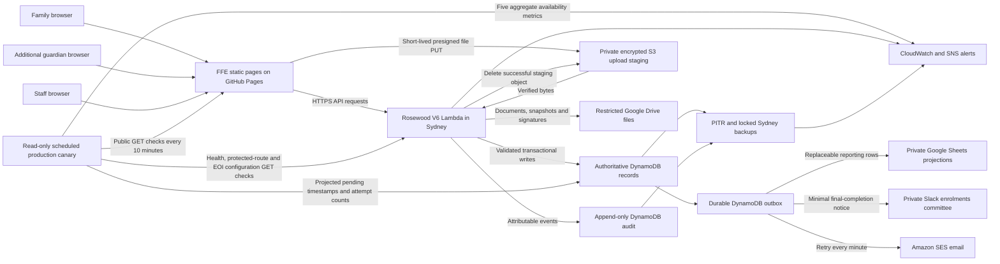

### Core Principle

AWS is authoritative for operational records. Google Sheets are reporting
projections, not the application database. Editing or deleting a Sheet row does not
change the application held in DynamoDB. Google Drive is the approved launch file
store for documents, JSON snapshots and signature images.

The production canary is operational monitoring only. It does not create or read a
family record and stores no applicant answers, invitation links, OTPs, address searches
or Google key. Its DynamoDB query projects only pending outbox timestamps and attempt
counters, not payloads. CloudWatch receives one binary availability value for each of
the public-asset, backend-health, EOI-address, protected-workflow and operational-pipeline
checks.

## Systems of Record

| Information | Authoritative location | Secondary representation | Notes |
| --- | --- | --- | --- |
| Application-link request and email duplicate index | Main DynamoDB table | Operations Application Link Requests tab | Request is separate from EOI; index points to the retained family invitation/application. |
| EOI answers and status | Main DynamoDB table | EOI and Operations Sheets | A JSON snapshot is also stored in restricted Drive. |
| Application invitation and link relationship | Main DynamoDB table | Operations Sheet | Raw invitation token is not stored; only its hash is retained. |
| OTP challenge | Main DynamoDB table | Minimal email-event projection | Code is emailed; only an HMAC is stored. Challenge expires automatically. |
| Verified session | Main DynamoDB table and browser memory | None | Raw session token stays in browser memory; only its hash is stored. |
| Application draft and revision | Main DynamoDB table | Progress and audit projections | Full draft answers are not written to a draft Sheet. |
| Submitted application | Main DynamoDB table | Normalised Application Sheets | A frozen JSON snapshot is stored in restricted Drive. |
| Supporting documents | Restricted Google Drive | DynamoDB and Sheet metadata | Private S3 is a temporary upload buffer only; portal lists metadata and staff open files through restricted Drive. |
| Signature image | Restricted Google Drive | DynamoDB and Sheet metadata | Staff API does not return the image. |
| Audit events | Separate append-only DynamoDB table | EOI, Application and Operations audit tabs | Detailed application views and state changes create events. |
| Email work and receipts | DynamoDB outbox/receipts plus SES | Operations Email Events | Outbox is retried every minute. |
| Slack completion work and receipts | DynamoDB outbox/receipts | Private `#enrolments-committee` message | Contains reference, completion time and staff-portal link only. Slack is not authoritative. |
| Backups | DynamoDB PITR and locked AWS Backup vault | None | Drive recovery is governed separately by Google account controls. |

## End-to-End State Model

```mermaid
stateDiagram-v2
    [*] --> Application_Invited: Public family requests link
    [*] --> EOI_Submitted: Optional public EOI
    EOI_Submitted --> Application_Invited: Staff explicitly creates linked invitation
    [*] --> Application_Invited: Staff creates direct invitation
    Application_Invited --> Application_Invited: Staff resend rotates invitation token
    Application_Invited --> Application_Invited: Staff renews expired access; application is preserved
    Application_Invited --> Application_In_Progress: First successful section save
    Application_In_Progress --> Application_In_Progress: Revisioned section saves
    Application_In_Progress --> Pending_Signatures: Primary guardian submits and more signatures are required
    Application_In_Progress --> Staff_Review: A required guardian is marked Do not contact
    Application_In_Progress --> Submitted: Primary guardian submits and is the only required signer
    Pending_Signatures --> Pending_Signatures: Applicant corrects email or resends; old task revoked
    Pending_Signatures --> Pending_Signatures: A guardian signs but others remain
    Pending_Signatures --> Staff_Review: Permitted signatures complete but suppressed consent remains
    Pending_Signatures --> Submitted: Final required guardian signs
    Staff_Review --> Pending_Signatures: Authorised staff permits contact and issues request
    Submitted --> [*]
```

An EOI is never converted into an application. When staff explicitly selects an EOI,
the application receives a `sourceEoiId`, reuses the EOI contact/student identifiers and
prefills approved values. The original EOI remains unchanged.

## Workflow 0: Request Application Link

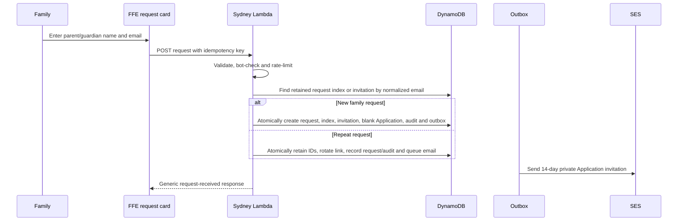

- Visible inputs are only parent/guardian name and email. There is no child, year-level,
  address, EOI or confirmation-email field.
- The request creates a direct invitation. An email match never links an EOI or copies
  EOI answers; that remains an explicit staff-only action.
- A high-entropy browser idempotency key makes a retry of one submission return the
  first result. Network and hashed-email limits constrain repeated new operations.
- A later legitimate request rotates the private link but preserves the invitation and
  Application IDs. If the expiring invitation index is already gone, the permanent
  email-bound request index and Application restore that same relationship.
- DynamoDB is authoritative. The Operations Sheet and staff request list are
  replaceable projections. The public response does not reveal whether an address
  already existed.

## Workflow 0B: Community Enquiry

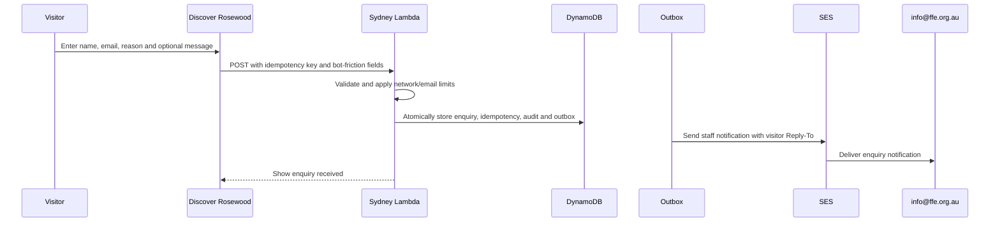

- The record is separate from EOI, Application, invitation, student and contact data.
- DynamoDB stores name, normalized email, approved reason, optional message, submitted
  time, keyed network fingerprint, source, status, schema version, form version and
  definition hash.
- `rosewood-community-enquiry-2026.1` defines the exact field and option meanings.
- The email is an operational notification, not the authoritative record. SES feedback,
  outbox retries and the permanent-failure alarm cover delivery failures.
- The workflow has no Google Sheet projection and sends no automatic acknowledgement to
  the visitor. Staff respond from the notification using the validated Reply-To address.
- The scheduled production canary checks the page, form script and backend health flag
  without submitting an enquiry or sending email.

## Common Security and Processing Controls

1. The URL is hidden and marked `noindex`, but URL secrecy is not treated as access
   control.
2. Application access requires both a high-entropy invitation token and an OTP sent to
   the invitation email.
3. Additional-guardian access requires both a high-entropy signing-task token and an OTP
   sent to that guardian's current permitted application email. No signing task or OTP
   is issued when contact permission is No.
4. Staff access requires an allowlisted email and OTP.
5. Family and child-application sessions expire after 90 minutes of inactivity and
   cannot exceed eight hours after verification. Guardian-signing sessions expire
   after 30 minutes. Staff sessions expire after two hours.
6. Session tokens stay in browser memory. V6 uses no cookies, local storage, session
   storage or IndexedDB.
7. OTPs expire after 10 minutes, allow five attempts and are subject to server-side
   cooldown, email, invitation/task and network limits.
8. Application saves use an expected revision. A stale browser receives a conflict
   rather than silently overwriting a newer record.
9. Raw IP addresses are not stored. The backend stores a keyed network fingerprint for
   defined submission/audit evidence.
10. DynamoDB records and backups use a customer-managed KMS key. Production tables have
    deletion protection and point-in-time recovery.

## Workflow 1: Expression of Interest

### Process

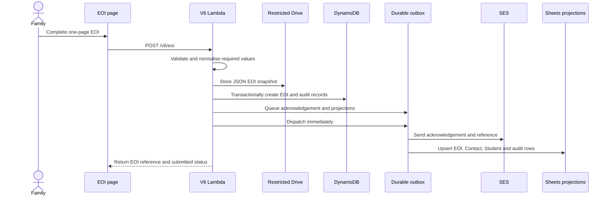

### EOI Sections and Data

| Section | Information collected | Processing and destination |
| --- | --- | --- |
| Primary Contact Details | Language, salutation, name, relationship, email and mobile | Validated into the EOI record; contact summary projected to Operations. |
| Primary Contact Address | Address, suburb, state, postcode and country | Optional Google search fills the existing controls; the family reviews/edits them. Only the final structured values are stored in the EOI record and EOI projection. |
| Student Details | Student name, DOB, gender, religion, intended year/year level, current school/year | Stored in the EOI record; student summary projected to Operations. |
| Additional Needs | Yes/No and category when Yes | Stored in the EOI record; treated as sensitive support information. |
| Family and Engagement | Family connection, other children, discovery source, questions | Stored in the EOI record and EOI projection. |

### EOI Outputs

- EOI identifier and human-readable `EOI-...` reference
- contact and student identifiers
- authoritative DynamoDB EOI record
- restricted Drive JSON snapshot
- append-only EOI and Operations audit events
- EOI, Contact and Student reporting rows
- acknowledgement email confirming that the EOI is **not** an Application for
  Enrolment

## Workflow 2: Staff Access and Invitation

### Staff Access

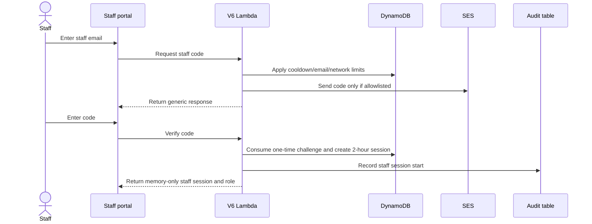

The current production allowlist uses `info@ffe.org.au`. The backend supports
`admin`, `admissions` and `viewer`; viewers cannot create or resend invitations.

### Invitation Decision

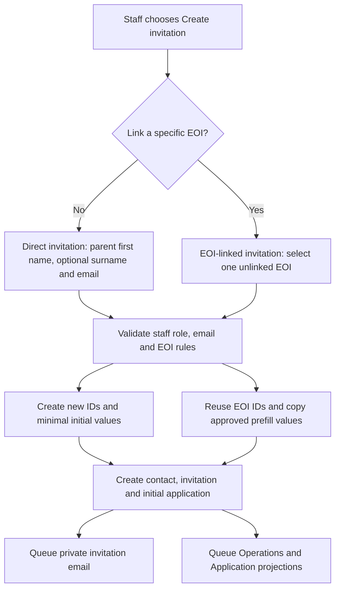

### Direct Invitation

- Used when there is no EOI or Rosewood intentionally does not link an earlier EOI.
- Matching an EOI email does not create an automatic link.
- Staff do not enter a child name. Parent/guardian first name and email are mandatory;
  surname is optional but encouraged.
- Backend creates the family contact, invitation and a blank initial application/student
  identifier. The Student projection is written after the family enters a child.
- Initial application status is `invited`, revision `0`, with two guardian slots and
  two emergency-contact slots.
- After OTP, the family can add multiple children. Every child receives an independent
  application ID, student ID, draft, documents, signatures, progress and outcome.

### EOI-Linked Invitation

- Staff must explicitly select the source EOI.
- EOI must exist, remain unlinked and use the same recipient email.
- Backend reuses contact and student identifiers.
- Selected EOI contact, student, address, enrolment and additional-needs fields are
  copied into the editable application draft.
- A Workflow Links projection records the relationship; the EOI itself is not changed.
- The family may add another child after login. A later child is a new direct
  application under the family invitation and is not silently linked to the EOI.

### Invitation Email Variants

- Both variants use `Invitation to Apply for Enrolment at Rosewood College`.
- Direct invitations thank the family, explain how to begin and do not name a child.
- EOI-linked invitations name the deliberately linked child, year level and entry year
  and explain that approved EOI information may be prefilled.
- Both include a button, a copy/paste private URL, `enrolment@ffe.org.au`, the Rosewood
  College Enrolment Team sign-off and an explicit expiry date.

### Invitation Token Handling

- The raw token appears only in the private email link and is returned internally to
  the email process, not to the staff browser.
- DynamoDB stores a SHA-256 token hash.
- Initial and replacement invitations expire after 14 days.
- Resend creates a new token, deletes the previous token-keyed record and invalidates
  the earlier URL atomically.
- The staff dashboard offers Resend only for active editable invitation access. It
  offers Renew access only when an editable application's invitation index is expired,
  inactive or missing; submitted applications offer neither.
- Renew access preserves the same invitation/application relationship and every saved
  application revision. A conditional idempotent transaction writes one replacement
  token/index, one email outbox event and one audit event without creating an
  application. If an expired token hash is still indexed, it is deleted in that same
  transaction. Access endpoints independently reject every expired token.
- The renewed invitation records `renewedAt`, the selected
  `renewalApplicationId` and a one-way `renewalOperationHash`. The raw operation ID and
  raw invitation token are not returned by the dashboard or written to ordinary logs.
  The audit event records the invitation ID, related-application count and whether the
  prior index was missing or expired/inactive; it does not copy application answers.

## Workflow 3: Application Access

### Welcome And Policy Review

The welcome presents the approved Enrolment Policy, Enrolment Procedure and Privacy
Policy as quiet optional-reference links rather than a prerequisite to beginning. A
family can open any policy inside the Application page. The selected policy is encoded
in the URL so direct links and browser Back work. Switching and returning preserve
welcome values in page memory. No policy-view event is sent to Lambda, DynamoDB, Google
Sheets, Google Drive, SES or analytics; reviewing a policy does not record acceptance.
The byte-identical Word source and canonical PDF are available as fallbacks.

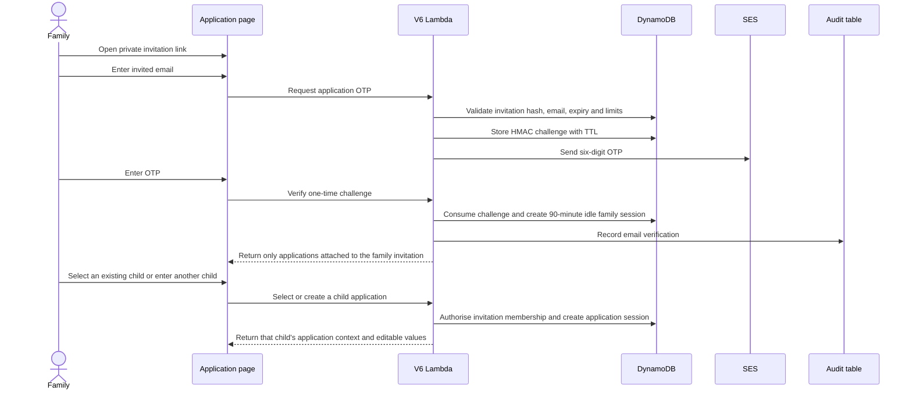

The API returns a generic response when requesting a code so the endpoint does not
confirm whether an invitation/email combination exists. The browser receives the raw
family and application session tokens and keeps them only in memory. Activity refreshes
their 90-minute idle window up to an eight-hour absolute limit. The family token
can list/select only the applications attached to its invitation. Every subsequent
draft, upload and submission request is scoped server-side to the selected child
application in its separate application session.

### Record Selection Screen

- EOI-linked invitation: shows the deliberately linked child and allows the family to
  review/edit the prefilled application.
- Direct invitation: asks for the first child's first and last name after OTP; staff do
  not provide it in the invitation screen.
- Returning families see every child application attached to the invitation and can
  continue any editable record.
- Families can add another child. The new child is created as a separate application;
  medical details, documents, progress and signatures are never merged across children.
- Server-side membership checks reject an application ID not attached to the verified
  invitation. The launch limit is eight child applications per invitation.

## Workflow 4: Five Application Sections

### Save Behaviour Shared by Sections

```mermaid
sequenceDiagram
    actor Family
    participant Page as Application page
    participant API as V6 Lambda
    participant DB as DynamoDB
    participant Audit as Audit table
    participant Outbox as Outbox
    participant Sheets as Operations Sheets

    Family->>Page: Enter or change an answer
    Page->>Page: Show In progress immediately
    Page->>Page: Debounce 1.2 seconds; force after 8 seconds of continuous typing
    Page->>API: PUT /v6/application/draft with expected revision and save mode
    API->>API: Sanitize allowed Application fields
    API->>DB: Conditional update to next revision
    API->>Audit: Append autosave or explicit-save event
    API->>Outbox: Queue Progress and audit projections
    Outbox->>Sheets: Update operational progress asynchronously
    API-->>Page: Return server-acknowledged revision and saved time
    Page->>Page: Show Saved only for the acknowledged revision
    Family->>Page: Select Next or another completed section
    Page->>API: Flush any pending revision before navigation
```

V6 does not send a draft request for every keystroke. It saves shortly after the family pauses
and at least every eight seconds during continuous typing. Identical drafts are not
written twice. The compact sticky header shows In progress, Saving, Saved, No connection,
Save failed or Session expired. On Documents it also shows Uploading or Upload failed.
The green Saved state means the server acknowledged the exact displayed revision;
selecting a file immediately starts a separately authorised upload.

Every application section includes **Save and continue later**. It flushes the current
answers, waits for any active Documents-page transfer, closes the selected child's
editing session and displays a close-safe confirmation. The verified family session
remains active, and **Return to child applications** returns directly to the selector.
Next can be selected while a file is uploading and waits for that transfer before
navigation. If the family later reopens the private invitation after expiry, completing
OTP returns them to the last acknowledged section. The child selector has Sign out
rather than Back, so it cannot return to an already-consumed OTP screen.

The browser mirrors the server's sliding 90-minute inactivity period and warns the
family five minutes before idle expiry. Choosing Continue session performs an
authorised read and renews the sliding window. A successful
authenticated request resets the browser timer. If the timer elapses, or the API reports
an expired/required session, a blocking dialog explains that the last acknowledged
progress remains safe and whether newer changes may need to be re-entered. It cannot be
dismissed with Escape or a close control. **Return to sign in** clears session-bound data
from browser memory and returns to the private Application gateway for a new OTP.

### Section 1: Student

| Subsection | Data categories | Important conditions | Destination |
| --- | --- | --- | --- |
| Student Details | Names, preferred name, DOB, gender, religion, current school/year, intended entry and interrupted schooling | Religion Other and Current School Other reveal required text fields. Interruption details appear after Yes. The separate previous-attendance question is retired in V6.8. | Draft `values`; final Student projection |
| Student Primary Address | Address sharing, address, suburb, state, postcode, country and compact Home Care Arrangement | Optional Google search fills the existing structured controls; the family reviews/edits them and manual entry remains available. Other care requires details; Shared Custody requires a parenting schedule. | Draft `values`; final Student projection |
| Family | Whether there are other children, apart from the child named in this application, who may apply in future, and how many | The form says not to include the named child. Count appears only after Yes. Validation returns to and focuses the exact unanswered control. | Draft `values`; final Student projection |
| Student's Nationality and Citizenship | Residence, birth, nationality, ethnicity, arrival/return date, residency, citizenship, evidence, visas, Indigenous status and languages | Non-citizen paths reveal residency evidence; most evidence choices require visa subclass/expiry. Main Language uses the catalogue; Other Languages is free text. | Draft `values`; final Student projection |
| General / Additional Needs | Formal assessment/report availability, need categories, current and possible Rosewood adjustments, professionals involved, reports, NDIS, court/parenting orders and other information | Assessment details appear after Yes. Need category and adjustment questions appear after additional-needs Yes; several support fields remain visible regardless. Reports Attached is Yes/N/A. | Draft `values`; final Student projection |
| Sacraments | Parish and optional sacrament date/location details | Date/location appears for each selected sacrament; future dates are rejected in the browser and backend. | Draft `values`; final Student projection as sacrament JSON |
| Medical Details | Conditions, allergies, optional EpiPen/Anapen choice, immunisation, humanitarian health, doctor, Medicare number/reference, insurance provider/policy, ambulance and Health Care Card | Other condition reveals text; doctor name/address/phone, Medicare number/reference, ambulance and card response are required; card details appear after Yes. | Draft `values`; final Student projection |

This section contains identity, health, disability/support, religious, Indigenous,
residency and court/parenting information and therefore has the highest privacy
sensitivity in the application.

The final Conditions page also contains an optional eleven-question Student and family
survey covering aptitude, preferred subjects, support subjects, hobbies/cultural
pursuits, sport, extra-curricular activity, library membership, school attractions,
desired qualities, mentoring value and intended years. Answers remain in the
authoritative application revision and append to the Conditions reporting projection.

### Section 2: Parent / Guardian

| Subsection | Data categories | Important conditions | Destination |
| --- | --- | --- | --- |
| Contact and sharing | Sharing choice, name, email, phones, relationship, contact type, marital status and religion | Each added guardian becomes a repeat record. | Draft `values`; final Guardians projection |
| Messaging and Health Care Card | SMS choice and Health Care Card status | Card number/expiry appear after Yes. | Draft `values`; final Guardians projection |
| Residential and postal address | Residential address and whether postal is the same | Optional Google search fills existing structured controls; separate postal fields and search appear after No; manual entry always remains available. | Draft `values`; final Guardians projection |
| Occupation and education | Occupational group, occupation, employer, school and further education | Core government-reporting fields are required. | Draft `values`; final Guardians projection |
| Residency | Birth country, nationality, optional ethnicity, languages, status, visa and Indigenous response | Temporary Resident reveals visa subclass and expiry. Country inputs use the shared searchable 249+ catalogue. | Draft `values`; final Guardians projection |
| Contact permission | Explicit Yes/No authority for Rosewood to contact an additional guardian | Yes requires an email for a separate request. No suppresses email, SMS, OTP, recovery and signing-request actions, requires an explanation and flags staff review. It is never inferred from entered contact details. | Draft `values`; final signer control and Guardians projection |
| Guardian confirmation | Confirmation that all legal parents/guardians were entered | Required before moving on. | Draft `values` |
| Emergency contacts | At least two names, relationships and phone details; email optional | Repeatable up to the server limit. | Draft `values`; final Emergency Contacts projection |

The application begins with two guardian records by default. A second guardian is the
normal path, but a family can reduce the count to one and provide an explanation in the
Signature section.

### Section 3: Documents

| Category | Required at submission | Accepted formats | Storage |
| --- | --- | --- | --- |
| Birth Certificate | Yes | PDF, JPG or PNG, maximum 10 MB per file | Restricted Application Drive folder |
| Immunisation / medical plans / professional reports | Optional | PDF, JPG or PNG, maximum 10 MB per file | Restricted Application Drive folder |
| Latest School Report / available NAPLAN | Optional | PDF, JPG or PNG, maximum 10 MB per file | Restricted Application Drive folder |
| Sacramental Certificates | Optional | PDF, JPG or PNG, maximum 10 MB per file | Restricted Application Drive folder |
| Passport / Visa Documentation | Optional | PDF, JPG or PNG, maximum 10 MB per file | Restricted Application Drive folder |

Proof of address is not collected.

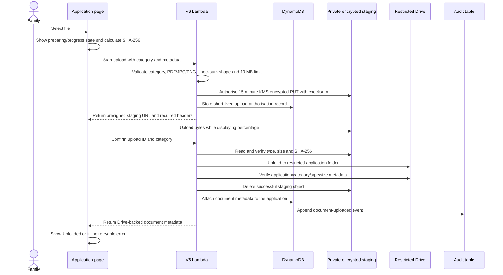

Staging keys contain opaque application/upload identifiers rather than filenames. They
are not exposed to staff, are not backed up and expire after one day if an interrupted
upload cannot be confirmed. Google Drive remains the authoritative file store.

The staff portal returns document metadata only. It does not generate public or
temporary download links. Authorised operators use the restricted enrolment Drive.
Automated malware scanning is outside the current launch scope.

### Section 4: Conditions

| Subsection | Data and decision | Destination |
| --- | --- | --- |
| Student commitments | HHC student commitments with Rosewood College substituted | Draft `values`; final Conditions projection |
| Parent / Carer commitments | HHC parent/carer commitments with Rosewood College substituted | Draft `values`; final Conditions projection |
| Acknowledgement | Confirmation that the applicant read the form particulars and obligations | Draft `values`; final Conditions projection |

This is not the Enrolment Agreement. Terms and Conditions of Enrolment and photography
permissions are deliberately excluded and belong to the future post-offer workflow.

### Section 5: Signature and Submission

The primary guardian must:

- acknowledge network-address recording language
- accept the application declaration
- provide a drawn or keyboard-accessible signature
- view the current signing date; the backend replaces any browser value with the
  Australia/Melbourne date at successful submission
- explain why only one guardian was entered, when applicable
- explain why a listed guardian marked Do not contact will not sign electronically
- otherwise acknowledge that each permitted additional guardian will receive a
  separate request after submission

The drawing remains only in browser memory while the guardian reviews other sections;
declarations and date remain ordinary revisioned draft answers. The sticky indicator
uses `Signature ready`, not `Saved`, until submission. A reload or expired session
requires a new drawing. Final submission revalidates every answer; any missing-answer
code is translated into its family-facing field and section with a direct review action
and inline highlight. The Conditions page independently enforces the exact-three
decision-influences rule before navigation.

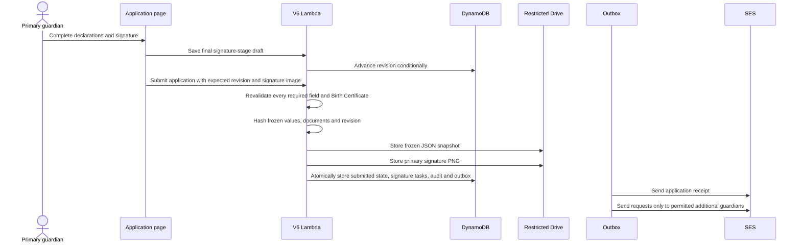

Submission creates an `APP-...` reference. A permitted additional signer creates
`pending_signatures`. A listed guardian marked Do not contact creates no task and marks
the submitted record `staff_review_required`; it is not reopened. With no additional
signature or staff-review requirement, status becomes `submitted`. The read-only family
status page shows required signers, masked email, explicit permission and request
sent/opened/verified/completed progress. Completed is shown only for a completed signer.

### Pending Signer Status, Correction and Resend

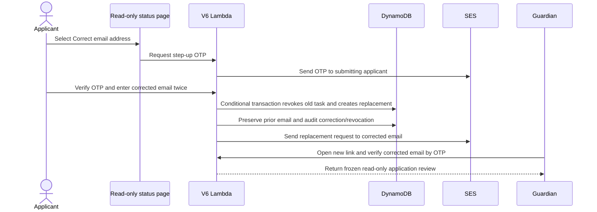

Correction and resend are available only while contact is permitted, an electronic
signature is required and that signature is incomplete. Corrections, OTP requests and
resends are rate-limited; replacement operations are idempotent. The previous task,
OTP challenges and signing sessions are invalid immediately. A compare-and-swap
`signatureControlRevision` plus old-task condition prevents correction and signing from
both succeeding. The application identifier, frozen answer revision and submitting
applicant signature remain unchanged. After completion, both actions disappear and the
signer displays only Complete.

## Workflow 5: Additional Application Guardian Signing

The initial request email contains only a greeting, a concise explanation of why the
recipient was contacted, the private signing link, expiry context and the enrolment
contact. It deliberately omits the student's name, family/medical details, answers and
internal identifiers. The private link alone reveals no application information: the
recipient must enter the invited email and complete OTP verification first.

### Process

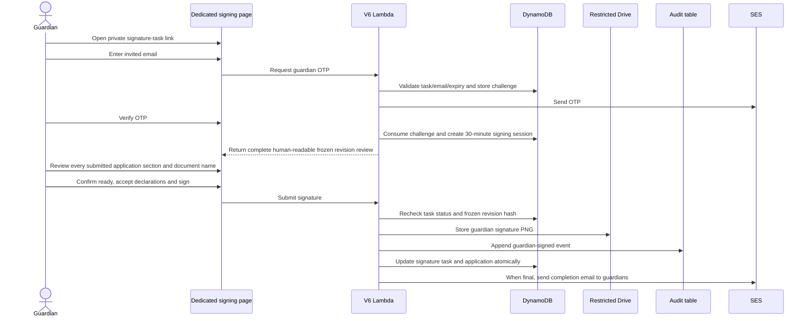

The guardian cannot edit the submitted application from the signing page. The task is
bound to the application ID, guardian ID, email, revision and revision hash. It expires
after 14 days and cannot be reused after signing. The OTP-authenticated review contains
the student, nationality/citizenship, additional-needs, sacrament, medical,
parent/guardian, emergency-contact, document, condition and primary-signature sections.
It is projected from the frozen application into human-readable labels. Internal IDs,
Drive/S3 locations, revision hashes, network fingerprints and signature image metadata
remain server-side.

## Workflow 6: Staff Dashboard and Review

### Dashboard Data

The dashboard reads authoritative DynamoDB entities and returns:

- EOI/application counts and status totals
- contact/student names and recipient emails
- references, stage, percentage, timestamps and invitation expiry/send count
- required and completed signature counts
- staff-review indicators for suppressed signature requirements
- recent transactional email summaries

The dashboard does not return medical answers, full application answers, documents,
signature images, network fingerprints or raw invitation links.

### Admissions Overview Projection

The staff landing view is calculated when `GET /v6/staff/dashboard` reads the
authoritative records:

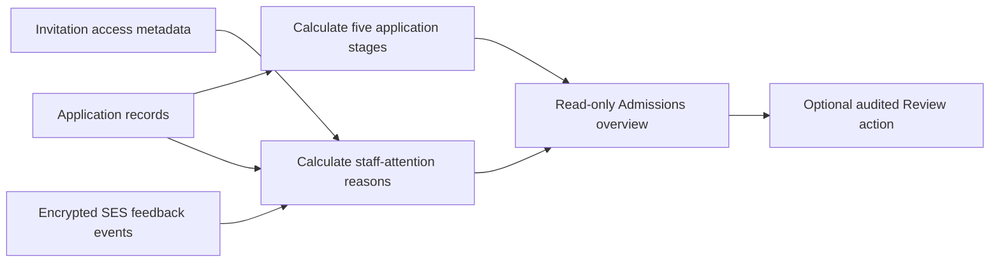

The five stages are Not started, In progress, Awaiting signatures, Staff review and
Application complete. They describe child-application progress, not an offer or
enrolment decision. Counts therefore use application records rather than families.

The attention queue derives failed/delayed workflow email, unavailable invitation
access, seven-day draft inactivity, three-day outstanding signatures, staff-review
status and missing entry details. Calculating, filtering or viewing the queue performs
no write and sends no message. The aggregate projection omits recipient email, date of
birth, health/document answers, raw SES identifiers, signature images, invitation
tokens and network metadata. Google Sheets are not read to create this view.

### Detailed Review

An authorised staff member can request one application detail view. The backend returns
the current application answers plus document metadata and signature metadata, but not
signature images or network fingerprints. Every detailed view appends a
`staff.application_viewed` audit event with the staff identity and role.

Signer detail includes explicit contact permission, current application email,
restricted previous-email history, correction requester/time, request generation,
SES-acceptance/open/verification state, link revocation, completion, signed revision,
staff-review requirement and the applicant's one-signature explanation. Viewer staff
cannot change permission. Admin/admissions must enter the exact confirmation before a
conditional audited permission change; changing to No revokes the active task, while
changing to Yes generates a new task only when a valid current email exists.

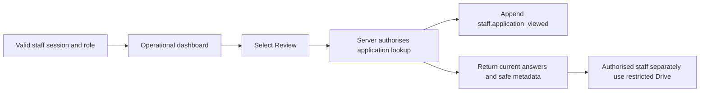

## Asynchronous Email, Slack and Sheet Processing

Business-state changes, audit events and their outbox work are written together where
the workflow requires atomicity. Delivery is then attempted immediately for major
operations and retried by EventBridge every minute.

```mermaid
stateDiagram-v2
    [*] --> Pending: Outbox item created
    Pending --> Leased: Worker claims 60-second lease
    Leased --> SentReceipt: SES, Slack or Sheet operation succeeds
    Leased --> Pending: Delivery fails before attempt 8
    Leased --> FailedReceipt: Attempt 8 fails; alarm metric emitted
    SentReceipt --> [*]: Pending item removed; receipt retained temporarily
    FailedReceipt --> [*]: Failure retained for authorised recovery
```

### Automatic Emails

| Trigger | Recipient | Message |
| --- | --- | --- |
| Public application-link request | Requested family email | Parent-addressed private Application link, no child name and 14-day expiry |
| EOI submission | Primary EOI contact | EOI acknowledgement and reference |
| Direct application invitation | Invited family email | Parent-addressed private link, no child name and 14-day expiry |
| EOI-linked application invitation | Invited EOI email | Linked child/year details, prefill explanation, private link and 14-day expiry |
| Invitation resend | Invited family email | Replacement link; prior link invalidated |
| Application access | Invited family email | Six-digit OTP |
| Staff access | Allowlisted staff email | Six-digit staff OTP |
| Primary application submission | Primary guardian | Receipt, reference and signature status |
| Additional guardian required | Each permitted eligible additional guardian | Private application-signing link |
| Pending email correction | Submitting applicant | Step-up OTP before correction |
| Corrected pending signer | Corrected permitted guardian email | Replacement link; prior task invalidated |
| Guardian access | Invited guardian email | Six-digit signing OTP |
| Final required signature | Guardian emails | Application complete confirmation |

SES sends as `enrolment@ffe.org.au`. SPF, DKIM and DMARC have been verified. The
stack-managed configuration set sends encrypted delivery feedback to the Lambda for
send, delivery, delay, bounce, complaint, reject and rendering failure. Events are
deduplicated and projected without recipient addresses. Pending guardian controls are
updated through the SES message/task index; lower-ranked late events cannot downgrade a
final state.

### Staff Slack Notifications

| Trigger | Destination | Information disclosed |
| --- | --- | --- |
| Application reaches `pending_signatures`, including after an intermediate signer completes while another remains | Private `#enrolments-committee` | Student name, completed signer names, outstanding signer names, Application reference, Melbourne submission time and authenticated staff-portal link |
| Application reaches authoritative `submitted` status | Board-access-only workspace channel `#enrolments` | Student name, all completed signer names, Application reference, Melbourne completion time and authenticated staff-portal link |

The same transaction that changes the Application state queues the corresponding Slack
outbox event. A pending event is queued after the primary signature and after each
intermediate required signature while another permitted electronic signer remains. A
completion event is queued immediately for a one-guardian application or when the last
required signer completes. `staff_review_required` does not notify. Delivery is retried
by the existing one-minute outbox worker, and a receipt prevents duplicate delivery
after success. Slack stores no application answers and cannot change workflow state.

## Google Sheets Projection Map

| Workbook | Tabs | Purpose |
| --- | --- | --- |
| EOI | EOIs, EOI Audit | EOI reporting and workflow audit |
| Application | Applications, Student, Guardians, Emergency Contacts, Documents, Conditions, Signatures, Application Audit | Normalised submitted application reporting |
| Operations | Contacts, Students, Application Link Requests, Application Invitations, Workflow Links, Progress, Email Events, Audit | Cross-workflow administration and monitoring |

Headers are an implementation contract and are repaired before writes. A controlled
rebuild can recreate all projection rows from DynamoDB. The rebuild is dry-run unless
an explicit apply confirmation is supplied.

## Data Access Matrix

| Actor | EOI/Application access | Documents | Signatures | Audit/operations |
| --- | --- | --- | --- | --- |
| Public visitor | Can open static pages; can request an Application link or submit EOI | None without verified application session | None | Receives only generic request status |
| Verified application family | Editable current application before submission; masked read-only status after submission | Can upload only before submission | Primary signature during submission; may step-up-authenticate to correct/resend a permitted pending signer | Own save/status responses only; no submitted-answer reopening |
| Verified additional guardian | Frozen review context for its signature task | No document access | Can submit only its assigned signature | Own completion status only |
| Viewer staff | Dashboard and detailed application review | Metadata in portal; restricted Drive only if separately authorised | Metadata only, no images | Read operational summaries; detailed view is audited |
| Admissions/Admin staff | Viewer access plus create/resend invitations | Same Drive boundary | Metadata plus explicit audited pending contact-permission change | Invitation, permission and review actions are audited |
| Restricted Drive operator | Files within approved enrolment folders | Direct restricted access | Direct restricted access where authorised | No automatic DynamoDB authority from Drive access |
| Google Sheets editor | Reporting projections | No file access from Sheet alone | Metadata only | Sheet edits do not alter authoritative records |
| AWS operator | Infrastructure and authoritative stores under AWS account controls | File IDs/metadata, not Google file contents by AWS alone | Metadata, not Drive image content by AWS alone | Backup, restore, logs and alarms |

## Retention, Backup and Recovery

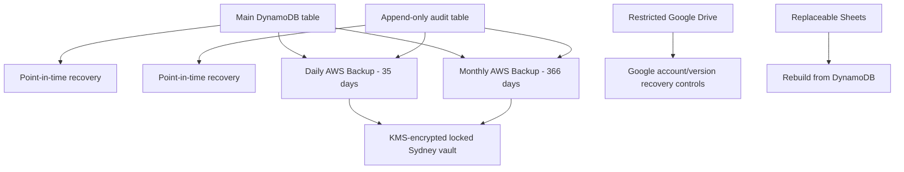

The AWS backup periods are operational recovery controls, not the approved legal
retention schedule. A full recovery drill completed on 6 August 2026: both tables were
restored to isolated names, KMS/schema and aggregate counts matched, the projection
rebuild passed in dry-run mode, and the temporary tables were deleted.

## Preview-Only Future Workflows

### Offer Acceptance / Enrolment Agreement

Planned screen sequence:

```text
Acceptance gateway -> OTP -> Select offer -> Student -> Parent/Guardian
-> Documents -> Conditions -> Primary signature -> Pending signatures
```

Mapped content includes offered student/year, acceptance declaration, guardians,
signed Parent and Student Codes of Conduct, 16 agreement clause headings, transfer of
information, photography/recording permission, ICT policy and guardian signatures.
Rosewood-approved legal text, document versions, persistence, invitation records,
emails and audit contracts are not yet implemented.

### Enrolment Agreement Guardian Signing Preview

Mapped sequence:

```text
Identity -> OTP -> Introduction -> Your Details -> Read-only Review
-> Ready confirmation -> Sign -> Thank You -> Signed Form
```

This preview records nothing. It should become a separate state machine and database
contract rather than reusing Application signature tasks.

### Decline Offer Preview

Mapped sequence:

```text
Decline gateway -> OTP -> Select offer -> Student and decline reason/destination
-> Parent/Guardian -> Signature -> Capture boundary
```

The observed source process ended before a verified completion page, so V6 does not
invent a final receipt. A future backend must define decline authority, final status,
notifications, retention and the effect on the offer record.

## Question Changes And Historical Answers

```text
Immutable form definition
  -> new EOI/application is pinned to form version + definition hash
  -> family save includes the pinned contract
  -> Lambda checks expected revision and contract
  -> incoming visible fields merge into existing answers
  -> omitted/retired answers remain present
  -> transaction updates CURRENT and appends full REV# snapshot
  -> staff sees revision metadata
  -> selected historical answer access is separately authorised and audited
```

Changing a Sheet, removing a field from a future page, or adding a new required field
cannot rewrite an older application. Existing records stay under their original form
contract; new invitations can move to a new contract. Submitted Drive snapshots and
signature revision hashes also retain the form version and definition hash. See
`SCHEMA-EVOLUTION.md` for the mandatory release and migration rules.

## Current Decisions and Open Risks

### Implemented Decisions

- EOI and Application remain separate records.
- Direct invitation is supported and does not require an EOI.
- EOI linking is explicit and email-bound.
- DynamoDB is authoritative; Sheets are replaceable projections.
- Restricted Google Drive is the launch file store.
- Proof of address is not collected.
- Google Places is an optional browser-side address-suggestion processor for the EOI
  primary-contact address and selected Application addresses. It receives
  only search text entered into that control and returns address components. Rosewood
  does not request/store Place IDs, coordinates, search history or device location;
  only the existing structured address answers enter DynamoDB and Sheets projections.
- Application terms and photography permission are deferred to the Enrolment Agreement.
- Contact permission is explicit and suppresses all automated contact and signing
  activity when No. Such records retain the one-signature explanation and require staff
  review. Staff can change permission only through an explicit audited conditional
  action; no-contact recovery is prohibited.
- Missing signing tasks can be recovered by a dry-run-first operational command that
  preserves the frozen answers and records an append-only audit event.
- GuardDuty, SQL and cross-region replication are outside launch scope.

### Stakeholder Decisions Still Required

1. Approve the Privacy Collection Notice, Privacy Policy, Application declarations,
   Enrolment Agreement and supporting policy/document versions.
2. Approve legal retention, deletion, correction, withdrawal and incident-response
   processes across DynamoDB, Drive, Sheets, SES records and exports.
3. Replace the shared staff mailbox with named staff identities, approved roles,
   offboarding and periodic access review.
4. Define any future submitted-answer correction workflow separately; V6 corrects only
   a pending signer's application email and never reopens submitted answers.
5. Define the business process after `submitted`: assessment, decision, offer,
   acceptance or decline, and family communications.
6. Implement Acceptance, Enrolment Agreement signing and Decline as separate backend
   workflows only after their governance contracts are approved.
7. Decide whether automated upload scanning becomes necessary if volume, risk or file
   types expand.

## Implementation Route Appendix

| Route | Purpose |
| --- | --- |
| `GET /v6/health` | Service and schema health |
| `POST /v6/session/logout` | Revoke the supplied browser session |
| `POST /v6/eoi` | Validate and submit EOI |
| `POST /v6/application-link-requests` | Validate, deduplicate and queue a direct family Application invitation |
| `POST /v6/community-enquiries` | Validate and atomically store a community enquiry and queue the staff notification |
| `POST /v6/application/access/request-code` | Validate invitation/email and request OTP |
| `POST /v6/application/access/verify-code` | Consume OTP and create family session |
| `GET /v6/application/family` | Restore an active family selector session after a same-tab refresh |
| `POST /v6/application/records/select` | Authorise and open one existing child application |
| `POST /v6/application/records` | Create or initialise a separate child application |
| `GET /v6/application/context` | Reload session-bound application context |
| `PUT /v6/application/draft` | Revisioned autosave, navigation save or save-and-close |
| `POST /v6/application/documents/start` | Authorise a constrained encrypted staging upload |
| `POST /v6/application/documents/confirm` | Verify staging, move to Drive and attach document metadata |
| `POST /v6/application/submit` | Freeze revision, save primary signature and submit |
| `POST /v6/application/records/status` | Open a secure read-only status session |
| `GET /v6/application/status` | Return masked signature progress and eligible actions |
| `POST /v6/application/status/signatures/resend` | Rate-limited idempotent task rotation and resend |
| `POST /v6/application/status/signatures/correction/request-code` | Step-up OTP to submitting applicant |
| `POST /v6/application/status/signatures/correction/verify-code` | Create short correction session |
| `POST /v6/application/status/signatures/correction/confirm` | Correct email, revoke old task and send replacement |
| `POST /v6/application/signatures/opened` | Record that the current private task link was opened |
| `POST /v6/application/signatures/request-code` | Request additional-guardian OTP |
| `POST /v6/application/signatures/verify-code` | Create signing session for assigned task |
| `POST /v6/application/signatures/submit` | Validate and append guardian signature |
| `POST /v6/staff/access/request-code` | Request allowlisted staff OTP |
| `POST /v6/staff/access/verify-code` | Create role-bound staff session |
| `GET /v6/staff/dashboard` | Return safe operational summaries |
| `POST /v6/staff/applications/detail` | Return audited application detail |
| `POST /v6/staff/applications/revision` | Return one authorised, audited immutable answer revision |
| `POST /v6/staff/invitations` | Create direct or EOI-linked invitation |
| `POST /v6/staff/invitations/resend` | Rotate token and resend active invitation |
| `POST /v6/staff/invitations/renew-access` | Restore expired/missing access to the same editable application without duplicating it |
| `POST /v6/staff/applications/contact-permission` | Explicit audited pending-signer permission change |

## Related Records

- `README.md` - V6 scope and URLs
- `PRODUCT-DECISIONS.md` - permanent product decisions
- `ARCHITECTURE-HARDENING.md` - launch architecture and control choices
- `STAFF-PORTAL-RUNBOOK.md` - staff operating instructions
- `RECOVERY-RUNBOOK.md` - backup and recovery procedure
- `SCHEMA-EVOLUTION.md` - immutable form versions, revision history and migration rules
- `TESTING.md` - frontend, backend, email and recovery evidence
- `RELEASE-BLOCKERS.md` - governance and production gates
- `backend/README.md` - technical backend contract
